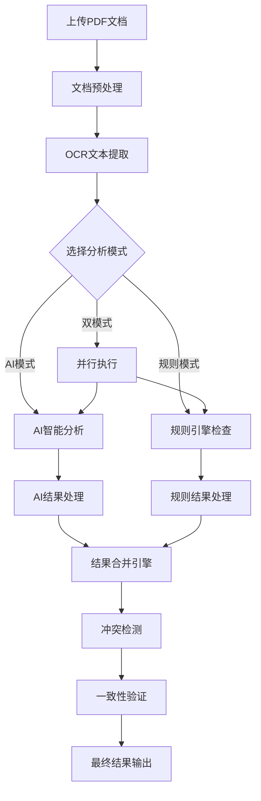

# 双模式分析功能指南

## 概述

双模式分析是政府预决算检查系统的核心创新功能，它将传统的基于规则的检测与现代AI智能分析相结合，提供更全面、准确的预决算文档审查能力。

## 功能特性

### 🤖 AI智能分析
- **语义理解**: 深度理解文档内容和上下文
- **复杂推理**: 识别隐含的逻辑问题和异常模式
- **自然语言描述**: 提供人性化的问题描述和建议
- **自适应学习**: 基于大语言模型的智能判断

### 📋 规则引擎检查
- **标准化检测**: 基于预定义规则的快速检测
- **精确匹配**: 准确识别格式、数值范围等问题
- **高效处理**: 快速处理结构化数据
- **可配置规则**: 支持自定义检查规则

### 🔄 智能融合
- **结果合并**: 智能合并两种模式的检测结果
- **冲突检测**: 自动识别和处理检测结果的差异
- **一致性验证**: 验证不同检测方式的结果一致性
- **置信度评估**: 基于多模式一致性评估结果可靠性

## 工作原理

### 分析流程



### 核心组件

#### 1. AI分析器 (AIAnalyzer)
```python
class AIAnalyzer:
    """AI智能分析器"""
    
    def analyze(self, document_content: str, context: JobContext) -> List[AIFinding]:
        """
        使用AI模型分析文档内容
        
        Args:
            document_content: 文档文本内容
            context: 分析上下文
            
        Returns:
            AI检测结果列表
        """
        # 构建AI提示词
        prompt = self._build_analysis_prompt(document_content, context)
        
        # 调用AI模型
        ai_response = self._call_ai_model(prompt)
        
        # 解析AI响应
        findings = self._parse_ai_response(ai_response)
        
        return findings
```

#### 2. 规则引擎 (RuleEngine)
```python
class RuleEngine:
    """规则检查引擎"""
    
    def check(self, document_data: Dict, context: JobContext) -> List[RuleFinding]:
        """
        基于规则检查文档
        
        Args:
            document_data: 结构化文档数据
            context: 分析上下文
            
        Returns:
            规则检测结果列表
        """
        findings = []
        
        # 遍历所有规则
        for rule in self.rules:
            if rule.is_applicable(context):
                result = rule.evaluate(document_data)
                if result.is_violation:
                    findings.append(result.to_finding())
        
        return findings
```

#### 3. 结果合并器 (ResultMerger)
```python
class ResultMerger:
    """结果合并器"""
    
    def merge(self, ai_findings: List[AIFinding], 
              rule_findings: List[RuleFinding]) -> MergedResult:
        """
        合并AI和规则检测结果
        
        Args:
            ai_findings: AI检测结果
            rule_findings: 规则检测结果
            
        Returns:
            合并后的结果
        """
        # 检测冲突
        conflicts = self._detect_conflicts(ai_findings, rule_findings)
        
        # 检测一致性
        agreements = self._detect_agreements(ai_findings, rule_findings)
        
        # 合并结果
        merged_findings = self._merge_findings(ai_findings, rule_findings, conflicts)
        
        return MergedResult(
            ai_findings=ai_findings,
            rule_findings=rule_findings,
            merged_findings=merged_findings,
            conflicts=conflicts,
            agreements=agreements
        )
```

## 使用指南

### 1. 选择合适的分析模式

#### AI模式 - 适用场景
- **复杂文档**: 格式不规范、结构复杂的文档
- **语义分析**: 需要理解文档语义和上下文的场景
- **创新检测**: 发现新类型问题和异常模式
- **详细建议**: 需要具体改进建议的情况

```python
# 使用AI模式
result = await analyze_document(file, mode="ai")
```

#### 规则模式 - 适用场景
- **标准文档**: 格式规范、结构清晰的文档
- **快速检测**: 需要快速获得结果的场景
- **精确匹配**: 检查特定格式和数值范围
- **批量处理**: 处理大量相似文档

```python
# 使用规则模式
result = await analyze_document(file, mode="local")
```

#### 双模式 - 适用场景
- **全面检查**: 需要最全面检测覆盖的场景
- **质量保证**: 重要文档的深度审查
- **结果验证**: 需要多重验证的关键检查
- **学习优化**: 通过对比优化检测规则

```python
# 使用双模式（推荐）
result = await analyze_document(file, mode="dual")
```

### 2. 理解双模式结果

#### 结果结构
```json
{
  "mode": "dual",
  "dual_mode": {
    "ai_findings": [...],      // AI检测结果
    "rule_findings": [...],    // 规则检测结果
    "merged": {
      "totals": {...},         // 统计信息
      "conflicts": [...],      // 冲突详情
      "agreements": [...],     // 一致详情
      "summary": {...}         // 结果汇总
    }
  }
}
```

#### 冲突类型及处理

##### 1. 严重程度冲突 (Severity Mismatch)
```json
{
  "conflict_type": "severity_mismatch",
  "ai_finding": {
    "severity": "high",
    "title": "预算执行率异常"
  },
  "rule_finding": {
    "severity": "medium", 
    "title": "预算执行率偏低"
  },
  "resolution": "采用AI判断，因为包含更多上下文信息",
  "final_severity": "high"
}
```

**处理策略**:
- AI检测通常包含更多上下文，优先采用AI判断
- 规则检测更精确，在数值类问题上优先采用规则判断
- 结合置信度和证据强度综合判断

##### 2. 分类冲突 (Category Mismatch)
```json
{
  "conflict_type": "category_mismatch",
  "ai_finding": {
    "category": "budget_execution",
    "title": "预算执行进度异常"
  },
  "rule_finding": {
    "category": "calculation_error",
    "title": "执行率计算错误"
  },
  "resolution": "创建复合分类问题",
  "final_category": "budget_execution,calculation_error"
}
```

**处理策略**:
- 创建复合分类，同时标记多个相关类别
- 保留原始分类信息供后续分析
- 在汇总统计中分别计算

##### 3. 检测范围冲突 (Scope Mismatch)
```json
{
  "conflict_type": "scope_mismatch",
  "description": "AI检测到整体趋势问题，规则检测到具体数值问题",
  "resolution": "合并为层次化问题结构",
  "hierarchy": {
    "parent": "ai_finding",
    "children": ["rule_finding"]
  }
}
```

**处理策略**:
- 建立层次化问题结构
- 宏观问题作为父级，具体问题作为子级
- 保持问题间的逻辑关联

#### 一致性类型

##### 1. 完全匹配 (Full Match)
```json
{
  "agreement_type": "full_match",
  "confidence": 0.95,
  "description": "两种方式检测到完全相同的问题",
  "boost_factor": 1.2
}
```

##### 2. 部分匹配 (Partial Match)
```json
{
  "agreement_type": "partial_match", 
  "confidence": 0.78,
  "description": "检测到相关但不完全相同的问题",
  "similarity_score": 0.85
}
```

##### 3. 互补检测 (Complementary)
```json
{
  "agreement_type": "complementary",
  "description": "两种方式检测到同一根本问题的不同方面",
  "relationship": "cause_effect"
}
```

### 3. 前端界面使用

#### 视图模式切换
```typescript
// 标签页视图 - 分别展示AI和规则结果
<IssueTabs 
  aiFindings={dualModeResult.ai_findings}
  ruleFindings={dualModeResult.rule_findings}
  conflicts={dualModeResult.merged.conflicts}
  agreements={dualModeResult.merged.agreements}
/>

// 列表视图 - 统一展示合并结果
<IssueList 
  issues={mergedIssues}
  onIssueSelect={setSelectedIssue}
  showSource={true}
/>

// 卡片视图 - 详细展示单个问题
<IssueCard 
  issue={selectedIssue}
  showEvidence={true}
  showSuggestions={true}
/>
```

#### 冲突可视化
```typescript
const ConflictVisualization = ({ conflicts }) => {
  return (
    <div className="conflicts-section">
      <h3>检测冲突分析</h3>
      {conflicts.map(conflict => (
        <div key={conflict.id} className="conflict-item">
          <div className="conflict-type">{conflict.conflict_type}</div>
          <div className="conflict-details">
            <div className="ai-side">
              <span className="source-badge ai">AI</span>
              {conflict.ai_finding.title}
            </div>
            <div className="vs-indicator">VS</div>
            <div className="rule-side">
              <span className="source-badge rule">规则</span>
              {conflict.rule_finding.title}
            </div>
          </div>
          <div className="resolution">
            <strong>解决方案:</strong> {conflict.resolution}
          </div>
        </div>
      ))}
    </div>
  );
};
```

## 最佳实践

### 1. 模式选择策略

#### 文档类型决策树
```
文档是否格式规范？
├─ 是 → 文档内容是否复杂？
│   ├─ 是 → 使用双模式
│   └─ 否 → 使用规则模式
└─ 否 → 是否需要深度分析？
    ├─ 是 → 使用双模式
    └─ 否 → 使用AI模式
```

#### 时间效率考虑
- **紧急检查**: 优先使用规则模式（速度快）
- **常规审查**: 使用双模式（全面准确）
- **深度分析**: 使用AI模式（详细建议）

### 2. 结果解读技巧

#### 置信度评估
```python
def assess_confidence(finding):
    """评估检测结果的置信度"""
    base_confidence = finding.confidence or 0.5
    
    # 多模式一致性加成
    if finding.source == "merged" and finding.agreement_count > 0:
        base_confidence *= 1.2
    
    # 证据强度加成
    evidence_score = len(finding.evidence) * 0.1
    base_confidence += evidence_score
    
    # 历史准确率调整
    historical_accuracy = get_historical_accuracy(finding.category)
    base_confidence *= historical_accuracy
    
    return min(base_confidence, 1.0)
```

#### 优先级排序
```python
def prioritize_issues(issues):
    """对问题进行优先级排序"""
    def priority_score(issue):
        severity_weight = {"high": 3, "medium": 2, "low": 1}
        confidence_weight = issue.confidence or 0.5
        evidence_weight = len(issue.evidence) * 0.1
        
        return (severity_weight[issue.severity] * 
                confidence_weight * 
                (1 + evidence_weight))
    
    return sorted(issues, key=priority_score, reverse=True)
```

### 3. 性能优化

#### 缓存策略
```python
# 文档指纹缓存
document_hash = hashlib.md5(document_content.encode()).hexdigest()
cached_result = cache.get(f"analysis:{document_hash}:{mode}")

if cached_result:
    return cached_result

# 规则结果缓存
rule_cache_key = f"rules:{document_hash}:{rule_version}"
ai_cache_key = f"ai:{document_hash}:{model_version}"
```

#### 并行处理
```python
async def dual_mode_analysis(document):
    """并行执行AI和规则分析"""
    ai_task = asyncio.create_task(ai_analyzer.analyze(document))
    rule_task = asyncio.create_task(rule_engine.check(document))
    
    ai_results, rule_results = await asyncio.gather(ai_task, rule_task)
    
    return merger.merge(ai_results, rule_results)
```

## 故障排除

### 常见问题

#### 1. AI服务不可用
```python
# 降级策略
try:
    ai_results = await ai_analyzer.analyze(document)
except AIServiceUnavailable:
    logger.warning("AI服务不可用，降级为规则模式")
    return await rule_engine.check(document)
```

#### 2. 结果合并失败
```python
# 容错处理
try:
    merged_result = merger.merge(ai_results, rule_results)
except MergeError as e:
    logger.error(f"结果合并失败: {e}")
    # 返回分离的结果
    return {
        "ai_findings": ai_results,
        "rule_findings": rule_results,
        "merge_error": str(e)
    }
```

#### 3. 冲突过多
```python
# 冲突阈值检查
if len(conflicts) > len(total_findings) * 0.3:
    logger.warning("冲突率过高，可能需要调整规则或AI提示")
    # 触发规则优化流程
    await optimize_rules(conflicts)
```

### 调试工具

#### 分析日志
```python
# 启用详细日志
logging.getLogger("dual_mode").setLevel(logging.DEBUG)

# 分析步骤追踪
@trace_analysis_step
def analyze_with_ai(document):
    # 分析逻辑
    pass
```

#### 结果对比
```python
# 结果差异分析
def compare_results(ai_results, rule_results):
    """对比分析结果差异"""
    differences = []
    
    for ai_finding in ai_results:
        similar_rules = find_similar_findings(ai_finding, rule_results)
        if not similar_rules:
            differences.append({
                "type": "ai_only",
                "finding": ai_finding
            })
    
    return differences
```

## 扩展开发

### 自定义规则
```python
class CustomRule(BaseRule):
    """自定义检查规则"""
    
    def __init__(self):
        super().__init__(
            rule_id="CUSTOM_001",
            name="自定义预算检查",
            category="custom"
        )
    
    def is_applicable(self, context: JobContext) -> bool:
        """判断规则是否适用"""
        return context.document_type == "budget_report"
    
    def evaluate(self, data: Dict) -> RuleResult:
        """执行规则检查"""
        # 自定义检查逻辑
        pass
```

### AI提示词优化
```python
class PromptOptimizer:
    """AI提示词优化器"""
    
    def optimize_prompt(self, base_prompt: str, 
                       feedback: List[Feedback]) -> str:
        """基于反馈优化提示词"""
        # 分析反馈模式
        patterns = self.analyze_feedback_patterns(feedback)
        
        # 调整提示词
        optimized_prompt = self.adjust_prompt(base_prompt, patterns)
        
        return optimized_prompt
```

---

通过合理使用双模式分析功能，您可以获得更准确、全面的预决算文档检查结果，提高审查效率和质量。